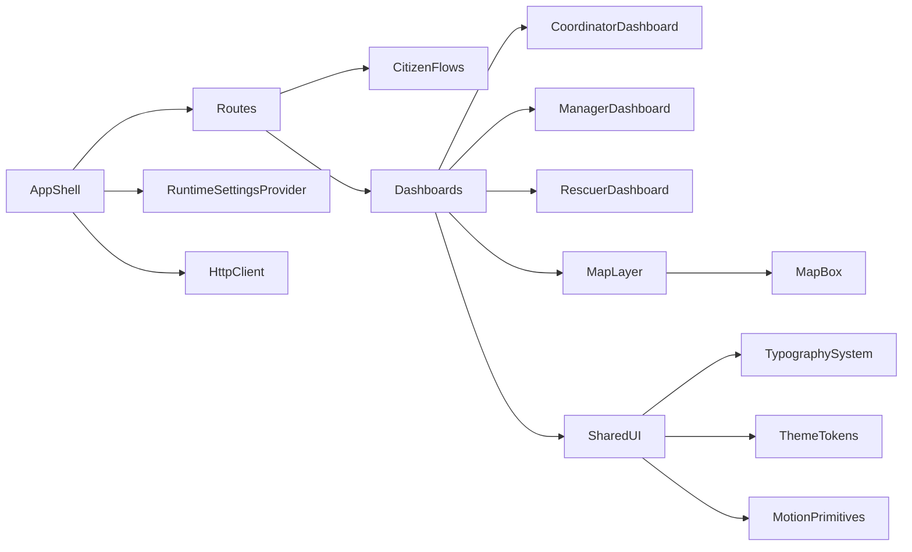

# Flood Rescue Frontend Review & UX/UI Upgrade

## Scope

- **Code review** of the existing React/Vite frontend with focus on performance, bugs/edge cases, security, accessibility, and code quality/cleanup.
- **UX/UI redesign direction**: soft-organic, urgent-rescue tone, keeping the current general color family but systematizing the palette and applying generous whitespace.
- Targeted changes in key files such as `[src/app/routes/index.jsx](src/app/routes/index.jsx)`, `[src/layouts/RootLayout.jsx](src/layouts/RootLayout.jsx)`, dashboards under `[src/pages](src/pages)`, shared HTTP utilities in `[src/shared/lib/http.js](src/shared/lib/http.js)`, and map components in `[src/features/map/components](src/features/map/components)`.

## Part 1 – Code Review & Engineering Improvements

### 1. Performance & Rendering

- **Route-level code splitting**
  - Replace eager imports of heavy routes in `[src/app/routes/index.jsx](src/app/routes/index.jsx)` with `React.lazy` + `Suspense` for manager, coordinator, rescuer, admin dashboards and map-heavy pages.
  - Example pattern:

```javascript
    const ManagerDashboardPage = React.lazy(() =>
      import('../pages/manager/ManagerDashboardPage.jsx')
    );

    <Route
      path={MANAGER_ROUTES.DASHBOARD}
      element={
        <RequireAuth>
          <RequireRole allow={[ROLES.MANAGER]}>
            <Suspense fallback={<FullPageSpinner />}>
              <ManagerDashboardPage />
            </Suspense>
          </RequireRole>
        </RequireAuth>
      }
    />
    

```

- **Polling & intervals**
  - Audit `setInterval` usage in `[src/layouts/RootLayout.jsx](src/layouts/RootLayout.jsx)` and `[src/pages/rescuer/RescuerDashboard.jsx](src/pages/rescuer/RescuerDashboard.jsx)` and other dashboards.
  - Introduce a small hook `useVisibleInterval(fn, delay)` that only runs when `document.visibilityState === 'visible'` and auto-cleans up.
  - Ensure no overlapping requests on manual refresh by tracking in-flight state in polling hooks.
- **Map performance & multiple Mapbox instances**
  - In `[src/features/map/components/MissionMapView.jsx](src/features/map/components/MissionMapView.jsx)` and dashboard screens, avoid rendering a full Mapbox map for each card.
  - Refactor lists to show static or lightweight previews, and keep a single primary `MapBox` instance for the selected mission/request.
- **Tables and large lists**
  - In manager/coordinator dashboards like `[src/pages/manager/ReliefRequestsPage.jsx](src/pages/manager/ReliefRequestsPage.jsx)` and `[src/pages/coordinator/CoordinatorDashboardPage.jsx](src/pages/coordinator/CoordinatorDashboardPage.jsx)`, add simple pagination (e.g. 20–50 rows) and prepare for optional virtualization later.

### 2. Bugs & Edge Cases

- **HTTP logging & agent logging**
  - In `[src/shared/lib/http.js](src/shared/lib/http.js)`, stop logging sensitive `Authorization` header and full request bodies, even in dev.
  - Guard agent-ingest `fetch('http://127.0.0.1:7760/ingest/...')` calls (seen in `main.jsx`, `http.js`, `RootLayout.jsx`) behind an explicit `VITE_AGENT_LOGGING` flag.
  - Example safer dev logging:

```javascript
    const { Authorization, ...safeHeaders } = headers;
    if (import.meta.env.DEV && import.meta.env.VITE_DEBUG === 'true') {
      console.log(`[API] ${method} ${fullUrl}`, { headers: safeHeaders });
    }
    

```

- **Error boundaries around routes**
  - Create a reusable `AppErrorBoundary` component (e.g. `[src/shared/ui/AppErrorBoundary.jsx](src/shared/ui/AppErrorBoundary.jsx)`) to catch runtime errors.
  - Wrap `<Routes>` or the root layout tree in `[src/app/routes/index.jsx](src/app/routes/index.jsx)` / `[src/layouts/RootLayout.jsx](src/layouts/RootLayout.jsx)` with this boundary, rendering a fail-safe screen with a “Quay về trang chính” button.
- **Rescue request form robustness**
  - In `[src/pages/citizen/RescueRequestCreatePage.jsx](src/pages/citizen/RescueRequestCreatePage.jsx)`, allow manual editing of `address` if reverse geocoding fails or yields low confidence (e.g. `isAddressEditable` state toggled when error occurs).
  - Add defensive checks around `navigator.geolocation` (permissions denied, unsupported) and provide clear inline guidance.
- **Derived state loops / address enrichment**
  - In `[src/pages/manager/ReliefRequestsPage.jsx](src/pages/manager/ReliefRequestsPage.jsx)`, refactor the effect that enriches `requests` with `displayLocationDescription` so it:
    - Tracks coordinates in a separate map (`id -> coordKey`).
    - Stores resolved addresses in `resolvedAddresses` state.
    - Computes `displayLocationDescription` at render-time from `requests` + `resolvedAddresses`, avoiding state writes in an effect that depends on `requests`.
- **Null/undefined guards**
  - Standardize helpers for optional numeric and date fields (`formatCount`, `formatDistance`, `formatDateTimeSafe`) and adopt them across dashboards, avoiding `undefined` in UI or date operations on nulls.

### 3. Security

- **Sensitive data in logs**
  - Complete the logging hardening mentioned above in `[src/shared/lib/http.js](src/shared/lib/http.js)` and any feature API modules that log payloads.
- **Attachment URLs & image safety**
  - Create a small utility `buildSafeFileUrl(rawUrl)` in e.g. `[src/shared/lib/files.js](src/shared/lib/files.js)` that:
    - Normalizes relative paths through a single `FILE_BASE_URL`.
    - Optionally whitelists domains for absolute URLs.
  - Replace direct `src={url}` usages for user/BE attachments in coordinator/manager/rescue components with this helper.
- **Mapbox token errors**
  - In `[src/features/map/components/MapBox.jsx](src/features/map/components/MapBox.jsx)`, add error handlers to display a friendly message when the token is invalid or style fails to load instead of hanging.

### 4. Accessibility

- **Icon-only buttons on maps**
  - In manager and coordinator map toolbars, add `aria-label` to icon-only buttons and ensure they remain keyboard-focusable.
  - Example:

```jsx
    <button
      type="button"
      aria-label="Phóng to bản đồ"
      title="Zoom in"
      onClick={handleZoomIn}
    >
      <ZoomInIcon />
    </button>
    

```

- **Dead `#` links**
  - In public home/landing pages, replace placeholder `to="#"` CTA links with:
    - A real route (e.g. citizen dashboard or request creation), or
    - A disabled button with `aria-disabled="true"` and descriptive helper text until implemented.
- **Audit forms & dialogs**
  - Quick pass over key forms (login, rescue/relief requests, assignment) to ensure each input has a proper label and that dialog components capture focus correctly when opened.

### 5. Code Quality & Cleanup

- **Console logs & debug artifacts**
  - Remove or gate `console.log`/`console.error` spam in feature pages, leaving only structured logs via a `debug()` helper.
- **Module duplication & HTTP utilities**
  - Consolidate HTTP helpers in `[src/shared/lib/http.js](src/shared/lib/http.js)` and remove/ignore legacy `httpUtils.js` if unused.
  - Resolve duplicate `citizen/api.js` paths so there is exactly one source of truth.
- **Component size & separation of concerns**
  - For large screens like `[src/pages/rescuer/RescuerDashboard.jsx](src/pages/rescuer/RescuerDashboard.jsx)` and `[src/pages/manager/ReliefRequestsPage.jsx](src/pages/manager/ReliefRequestsPage.jsx)`, extract:
    - Data hooks (e.g. `useRescuerDashboardData`, `useReliefRequests`) into `features/.../hooks`.
    - Pure presentational components (`RescuerMissionsList`, `ReliefRequestMapPanel`, `ReliefRequestTable`) into `shared/ui` or feature `components` folders.
- **Runtime settings & shared context**
  - Implement a `RuntimeSettingsProvider` + `useRuntimeSettings` hook that fetches `/public/runtime-settings` exactly once and memoizes the result for the session, replacing ad hoc fetches in multiple pages/layouts.

## Part 2 – UX/UI Upgrade (Soft-Organic, Urgent-Rescue)

### 1. Typography System

- **Font direction**
  - Replace generic fonts with a more characterful but highly readable pairing from Google Fonts:
    - **Display/Headings**: `Sora` (geometric, slightly soft, suitable for dashboards).
    - **Body/UI**: `DM Sans` (clean, humanist, works well at small sizes).
- **Implementation**
  - Add font imports in `index.html` or a global CSS file:

```html
    <link rel="preconnect" href="https://fonts.googleapis.com" />
    <link rel="preconnect" href="https://fonts.gstatic.com" crossorigin />
    <link href="https://fonts.googleapis.com/css2?family=DM+Sans:wght@400;500;600&family=Sora:wght@500;600;700&display=swap" rel="stylesheet" />
    

```

- Define a typographic scale in `tailwind.config.js` or global CSS tokens, emphasizing hierarchy on key screens (dashboards & maps):

```javascript
    theme: {
      extend: {
        fontFamily: {
          heading: ['Sora', 'system-ui', 'sans-serif'],
          body: ['DM Sans', 'system-ui', 'sans-serif'],
        },
        fontSize: {
          'display-lg': ['2.25rem', { lineHeight: '2.75rem', letterSpacing: '-0.03em' }],
          'display-md': ['1.875rem', { lineHeight: '2.25rem', letterSpacing: '-0.02em' }],
          'title': ['1.25rem', { lineHeight: '1.75rem', letterSpacing: '-0.01em' }],
        },
      },
    }
    

```

- Apply consistently:
  - App shell titles / page titles use `font-heading` + `display-*`.
  - Card titles, section headings use `title` size.
  - Body copy, table cells use `font-body` with comfortable line-height (~1.5).

### 2. Color & Theme

- **Palette direction** (keep current general color family, make it systematic):
  - **Dominant**: Deep rescue blue – `#0B5ED7` (primary buttons, key highlights, map overlays).
  - **Accent (urgent)**: Warm rescue orange – `#FF6B35` (SOS states, critical call-to-action, status chips).
  - **Secondary/support**: Soft teal – `#1FB5A7` (success, stable/assigned states, safe zones).
  - **Neutrals**:
    - Background: `#050816` (app shell) and `#0B1220` (content background) for dark mode feel.
    - Surfaces: `#111827` / `#1F2937` for cards and panels.
    - Borders/lines: `#293548`.
    - Text: `#F9FAFB` (primary), `#9CA3AF` (secondary).
- **Status colors**
  - Define semantic tokens (`--color-status-pending`, `--color-status-in-progress`, `--color-status-critical`, `--color-status-resolved`) and map them to the palette above, updating badges and chips in `shared/ui/Badge.jsx`.

### 3. Layout & Spacing

- **Overall layout**
  - Keep a **12-column grid** for desktop dashboards with generous outer gutters and fixed max-width for main content (e.g. `max-w-7xl`).
  - For citizen-facing flows, adopt a centered, card-based layout with breathing room and clear progression.
- **Spacing scale**
  - Standardize spacing tokens (e.g. 4, 8, 12, 16, 24, 32) and apply more `24–32px` vertical spacing between major sections.
- **Hierarchy**
  - On dashboards, break content into three clear layers:
    1. **Primary strip**: page title, key indicators (active missions, people waiting, etc.).
    2. **Map + controls**: large map panel occupying majority of width, with control panel aligned.
    3. **Detail lists**: tables/cards in a lower band, with sticky section headers.
- **Asymmetry & grid-breaking**
  - Allow the main map panel to “bleed” wider than side panels (e.g. 8/12 vs 4/12) to create visual tension and focus.
  - On citizen home/landing, introduce a diagonal or curved background shape behind the hero to produce a soft-organic feel.

### 4. Backgrounds & Depth

- **Background treatment**
  - Replace flat solid backgrounds with subtle gradient meshes/noise while keeping contrast high:

```css
    .app-shell-bg {
      background: radial-gradient(circle at top left, #1f2937 0, #020617 55%, #020617 100%);
      position: relative;
    }

    .app-shell-bg::before {
      content: '';
      position: absolute;
      inset: 0;
      background-image: url('/noise.png');
      opacity: 0.08;
      mix-blend-mode: soft-light;
      pointer-events: none;
    }
    

```

- **Card depth**
  - Promote important panels (live map, active missions list, SOS feed) with softer but layered shadows and slight transparency:

```css
    .panel-elevated {
      background: rgba(15, 23, 42, 0.92);
      box-shadow:
        0 18px 45px rgba(15, 23, 42, 0.9),
        0 0 0 1px rgba(148, 163, 184, 0.12);
      backdrop-filter: blur(18px);
    }
    

```

### 5. Motion & Interaction

- **Mount animations**
  - Use a lightweight library (or CSS transitions) to stagger in key sections on page mount:
    - Title row fades in first.
    - Map panel slides up with slight delay.
    - Lists/tables fade-in from bottom with staggered rows.
  - Example using a simple utility component `FadeInStagger` in `shared/ui/FadeInStagger.jsx` that wraps children with `transition` classes and delays.
- **Hover states**
  - Primary buttons: subtle scale (1.02) + shadow intensification + slight hue shift toward accent color.
  - Cards: background lighten + border accent on hover, especially for click-to-select items (missions/requests).
  - Map markers: pulse or grow subtly on hover/select, synchronized with the related card highlight.
- **Transitions on state changes**
  - Add `transition-colors`, `transition-transform`, `transition-opacity` with 150–220ms duration across interactive components (buttons, tabs, filters, panel toggles).

### 6. The Unforgettable Detail

- **“Rescue Beacon” micro-interaction**
  - Introduce a **pulsing rescue beacon** element that visually communicates urgency without being distracting:
    - For rescuers/coordinators, a small circular beacon in the header showing the number of waiting critical requests.
    - The beacon gently pulses with the accent orange `#FF6B35` when new critical requests arrive.
  - Implementation idea:
    - Create `RescueBeacon` component in `shared/ui/RescueBeacon.jsx` that takes `count` and `isCritical`.

```jsx
    <div className="relative inline-flex items-center">
      <span className="relative z-10 inline-flex h-7 min-w-[28px] items-center justify-center rounded-full bg-orange-500 px-2 text-xs font-medium text-white">
        {count}
      </span>
      {isCritical && (
        <span className="absolute inset-0 -z-10 animate-ping rounded-full bg-orange-500/50" />
      )}
    </div>
    

```

- Place this in the top bar of coordinator/rescuer dashboards near the title (e.g. “Yêu cầu khẩn cấp”) and wire it to live critical-request counts, reinforcing the product’s purpose every time the user logs in.

## High-Level Architecture Diagram




This plan focuses first on stabilizing and optimizing the existing frontend (performance, robustness, security, a11y, and maintainability), then layering on a cohesive visual system and interactions that match a soft-organic yet urgent-rescue tone with generous whitespace.