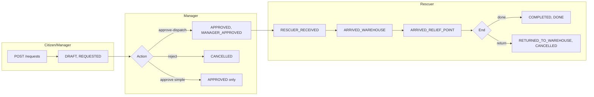

# Kiểm tra chức năng core flow Relief

## 1. Tổng quan luồng Relief

Core flow Relief gồm: **Citizen/Manager tạo yêu cầu** → **Manager duyệt và điều phối (gán đội + tạo phiếu xuất)** → **Rescuer nhận và cập nhật trạng thái giao hàng** → **Hoàn thành hoặc trả kho / từ chối**.

- **Trạng thái tài liệu** (`status`): `DRAFT` → `APPROVED` hoặc `CANCELLED` → (khi rescuer hoàn thành) `DONE`.
- **Trạng thái giao hàng** (`deliveryStatus`): [ReliefDeliveryStatus](src/main/java/com/floodrescue/shared/enums/ReliefDeliveryStatus.java) — `REQUESTED` → `MANAGER_APPROVED` → `RESCUER_RECEIVED` → `ARRIVED_WAREHOUSE` → `ARRIVED_RELIEF_POINT` → `COMPLETED` hoặc `RETURNED_TO_WAREHOUSE` hoặc `REJECTED`.

---

## 2. Các bước trong core flow (backend)

### 2.1 Tạo yêu cầu cứu trợ

- **API:** `POST /api/relief/requests` (hoặc `/api/manager/relief/requests`).
- **Controller:** [ReliefRequestController](src/main/java/com/floodrescue/module/relief/controller/ReliefRequestController.java) → `createReliefRequest`.
- **Service:** [ReliefRequestService.createReliefRequest](src/main/java/com/floodrescue/module/relief/service/ReliefRequestService.java) (khoảng dòng 52–99).
  - Validate `userId`, tạo mã code, tùy chọn gắn `rescueRequestId`.
  - Lưu `ReliefRequestEntity`: `status = DRAFT`, `deliveryStatus = REQUESTED`, địa chỉ/khu vực, lines (danh mục hàng + số lượng).
  - Trả về `ReliefRequestResponse`.

### 2.2 Duyệt và điều phối (luồng chính cho Manager)

- **API:** `PUT /api/relief/requests/{id}/approve-dispatch`.
- **Body:** [ReliefApproveDispatchRequest](src/main/java/com/floodrescue/module/relief/dto/request/ReliefApproveDispatchRequest.java) — `assignedTeamId` (bắt buộc), `note` (tùy chọn).
- **Service:** `ReliefRequestService.approveAndDispatch` (khoảng 103–144).
  - Chỉ xử lý khi relief đang `DRAFT` và có ít nhất một dòng hàng.
  - Tạo **Phiếu xuất kho** (Inventory Issue) qua [IssueService.createIssue](src/main/java/com/floodrescue/module/inventory/service/IssueService.java): issue trạng thái `DRAFT`, gắn `reliefRequestId`, `assignedTeamId`, lines copy từ relief.
  - Cập nhật relief: `status = APPROVED`, `approvedById`, `assignedTeamId`, `assignedIssueId`, `deliveryStatus = MANAGER_APPROVED`, `deliveryNote`.
  - Gửi thông báo cho citizen và đội rescuer.

Đây là bước **tạo phiếu xuất và gán đội**; trừ kho thực tế xảy ra khi rescuer cập nhật trạng thái (xem dưới).

### 2.3 Duyệt đơn giản (không điều phối)

- **API:** `PUT /api/relief/requests/{id}/approve`.
- **Service:** `ReliefRequestService.approveReliefRequest` (khoảng 333–358).
  - Chỉ đổi `status` → `APPROVED`, **không** tạo issue, **không** gán team, **không** đổi `deliveryStatus`. 
  - Luồng “điều phối” thực tế cần dùng **approve-dispatch**, không phải endpoint này.

### 2.4 Từ chối yêu cầu

- **API:** `PUT /api/relief/requests/{id}/reject` — body: [ReliefRequestRejectRequest](src/main/java/com/floodrescue/module/relief/dto/request/ReliefRequestRejectRequest.java) (`reason`).
- **Service:** `ReliefRequestService.rejectReliefRequest` (khoảng 360–386).
  - Chỉ từ chối khi `status == DRAFT`.
  - Cập nhật: `status = CANCELLED`, ghi `reason` vào `note` (tiền tố `[TU CHOI]`).
  - **Không** set `deliveryStatus = REJECTED` (xem mục 4.1).

### 2.5 Rescuer cập nhật trạng thái giao hàng

- **API:** `PUT /api/relief/rescuer/requests/{id}/delivery-status`.
- **Body:** [ReliefRescuerStatusUpdateRequest](src/main/java/com/floodrescue/module/relief/dto/request/ReliefRescuerStatusUpdateRequest.java) — `status`, `note`.
- **Service:** `ReliefRequestService.updateRescuerDeliveryStatus` (khoảng 252–314).
  - Chỉ chấp nhận: `RESCUER_RECEIVED`, `ARRIVED_WAREHOUSE`, `ARRIVED_RELIEF_POINT`, `COMPLETED`, `RETURNED_TO_WAREHOUSE`.
  - Kiểm tra rescuer thuộc đội được gán; không cho cập nhật khi relief đã `CANCELLED`.
  - Cập nhật `deliveryStatus` (và `deliveryNote` nếu có). Khi `status == COMPLETED` → relief `status = DONE`.
  - Đồng bộ với **Inventory Issue**:
    - **ARRIVED_RELIEF_POINT** và issue đang `DRAFT`: gọi `IssueService.markIssueTemporaryDeduction` → issue chuyển `APPROVED` (chưa trừ kho).
    - **COMPLETED** và issue đang `APPROVED`: gọi `IssueService.finalizeIssueDeduction` → trừ kho, issue → `DONE`.
    - **RETURNED_TO_WAREHOUSE**: gọi `IssueService.returnIssueToWarehouse`, relief `status` → `CANCELLED`.

### 2.6 Citizen: cập nhật / hủy yêu cầu (chỉ khi DRAFT)

- **Cập nhật:** `PUT /api/relief/citizen/requests/{id}` — body giống tạo mới (targetArea, address, lines, ...).
- **Hủy:** `DELETE /api/relief/citizen/requests/{id}?reason=...`.
- Service: `updateCitizenReliefRequest`, `cancelCitizenReliefRequest` — chỉ cho phép khi `status == DRAFT` và đúng `createdById`.

---

## 3. Tích hợp với Inventory (Issue)

- **approveAndDispatch** tạo 1 phiếu xuất (Issue) trạng thái `DRAFT`, gắn `reliefRequestId`, `assignedTeamId`, lines từ relief.
- Trừ kho **chỉ** khi rescuer báo **COMPLETED** (qua `finalizeIssueDeduction`). Trước đó, tại **ARRIVED_RELIEF_POINT**, issue chỉ chuyển từ `DRAFT` → `APPROVED` (tạm, chưa trừ kho).
- [IssueService](src/main/java/com/floodrescue/module/inventory/service/IssueService.java) còn có `approveIssue`: nếu issue gắn relief, khi duyệt issue sẽ cập nhật relief (approved, assignedTeamId, assignedIssueId, MANAGER_APPROVED). Luồng chính hiện tại là **approveAndDispatch** (tạo issue từ relief), không đi qua **approveIssue** riêng cho từng phiếu.

---

## 4. Điểm không nhất quán / rủi ro

### 4.1 Từ chối: không set `deliveryStatus = REJECTED`

- Controller gọi `rejectReliefRequest`, chỉ set `status = CANCELLED` và ghi reason vào `note`, **không** set `deliveryStatus = REJECTED`.
- Trong cùng service có `rejectRequest(reliefRequestId, reason)` (khoảng 148–164): set cả `deliveryStatus = REJECTED` và `deliveryNote`, nhưng **không được controller gọi**.
- **Khuyến nghị:** Thống nhất: khi từ chối (manager hoặc citizen hủy), nên set `deliveryStatus = REJECTED` (ví dụ gọi logic tương tự `rejectRequest` hoặc bổ sung trong `rejectReliefRequest`).

### 4.2 Hai endpoint duyệt: FE có thể gọi nhầm

- [Trieu_API.md](Trieu_API.md) ghi: FE đang gọi `PUT /api/relief/requests/{id}/approve`, trong khi luồng đầy đủ cần `PUT /api/relief/requests/{id}/approve-dispatch` (có body `assignedTeamId`, `note`).
- Backend có cả hai: **approve** (chỉ đổi status, không gán đội/issue) và **approve-dispatch** (đúng core flow).
- **Khuyến nghị:** Rà soát FE: nút “Duyệt và điều phối” phải gọi `approve-dispatch` với body; nếu không cần “duyệt đơn giản” thì có thể ẩn/bỏ dùng `/approve`.

### 4.3 N+1 khi list relief

- [ReliefRequestService](src/main/java/com/floodrescue/module/relief/service/ReliefRequestService.java): `listReliefRequests`, `listMyReliefRequests`, `listRescuerAssignedReliefRequests` dùng `page.map(r -> toResponse(r, reliefRequestLineRepository.findByReliefRequest(r)))` → mỗi relief 1 query lines riêng (N+1).
- **Khuyến nghị:** Dùng fetch/join (ví dụ `@EntityGraph` hoặc query với `JOIN FETCH` lines) để lấy lines theo batch hoặc một query có điều kiện theo danh sách relief id.

### 4.4 Repository Issue theo relief

- [IssueRepository](src/main/java/com/floodrescue/module/inventory/repository/IssueRepository.java): `findFirstByReliefRequestIdOrderByIdDesc(Long reliefRequestId)`.
- [InventoryIssueEntity](src/main/java/com/floodrescue/module/inventory/entity/InventoryIssueEntity.java) có quan hệ `reliefRequest` (ManyToOne), không có field `reliefRequestId`. Theo quy ước Spring Data JPA, tên method thường là `findFirstByReliefRequest_IdOrderByIdDesc` (property path `reliefRequest.id`). Cần kiểm tra runtime: nếu method hiện tại vẫn trả đúng kết quả thì có thể do cấu hình hoặc phiên bản; nếu sai thì đổi tên method cho khớp entity.

---

## 5. Tóm tắt API core flow Relief

| Bước                        | Method | Endpoint                                            | Role                             | Ghi chú                                                               |
| --------------------------- | ------ | --------------------------------------------------- | -------------------------------- | --------------------------------------------------------------------- |
| Tạo                         | POST   | `/api/relief/requests`                              | ADMIN, MANAGER, CITIZEN          | Body: targetArea, address, lat/lng, lines, rescueRequestId (optional) |
| Duyệt + điều phối           | PUT    | `/api/relief/requests/{id}/approve-dispatch`        | ADMIN, MANAGER                   | Body: assignedTeamId, note — **luồng chính**                          |
| Duyệt đơn giản              | PUT    | `/api/relief/requests/{id}/approve`                 | ADMIN, MANAGER                   | Không gán đội/issue                                                   |
| Từ chối                     | PUT    | `/api/relief/requests/{id}/reject`                  | ADMIN, MANAGER                   | Body: reason                                                          |
| Rescuer cập nhật trạng thái | PUT    | `/api/relief/rescuer/requests/{id}/delivery-status` | RESCUER                          | Body: status, note                                                    |
| Chi tiết                    | GET    | `/api/relief/requests/{id}`                         | ADMIN, MANAGER, CITIZEN, RESCUER |                                                                       |
| Danh sách (manager)         | GET    | `/api/relief/requests`                              | ADMIN, MANAGER                   | Query: status, pageable                                               |
| Danh sách (citizen)         | GET    | `/api/relief/citizen/requests`                      | CITIZEN                          |                                                                       |
| Danh sách (rescuer)         | GET    | `/api/relief/rescuer/requests`                      | RESCUER                          | Theo teamId                                                           |

---

## 6. Kiểm tra thủ công gợi ý

1. **Tạo relief** (CITIZEN/MANAGER): POST với ít nhất 1 line (itemCategoryId, qty, unit) → kiểm tra DB: `relief_requests` (DRAFT, REQUESTED), `relief_request_lines`.
2. **Duyệt + điều phối** (MANAGER): PUT approve-dispatch với `assignedTeamId` hợp lệ → kiểm tra: relief (APPROVED, MANAGER_APPROVED, assigned_team_id, assigned_issue_id), bản ghi `inventory_issues` + `inventory_issue_lines` tương ứng.
3. **Rescuer**: PUT delivery-status lần lượt RESCUER_RECEIVED → ARRIVED_WAREHOUSE → ARRIVED_RELIEF_POINT → COMPLETED → kiểm tra relief (DONE), issue (DONE), tồn kho đã trừ.
4. **Từ chối**: PUT reject với reason → kiểm tra status CANCELLED; hiện tại deliveryStatus không đổi (xem 4.1).
5. **Citizen hủy**: DELETE citizen/requests/{id} khi DRAFT → CANCELLED, REJECTED (trong cancelCitizenReliefRequest đã set REJECTED).

---

Kế hoạch này chỉ **kiểm tra và mô tả** core flow Relief cùng các điểm cần sửa; không thực hiện thay đổi code cho đến khi bạn xác nhận.